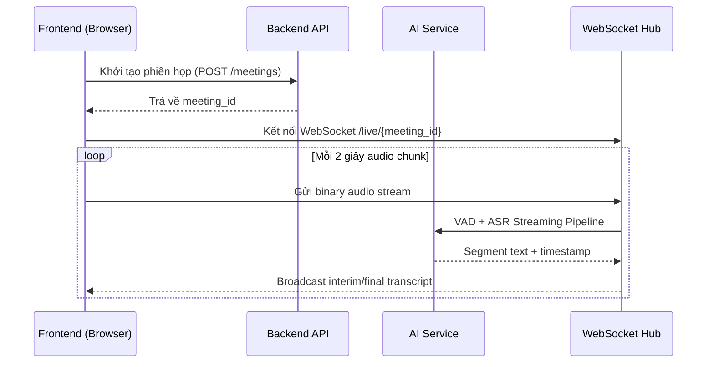
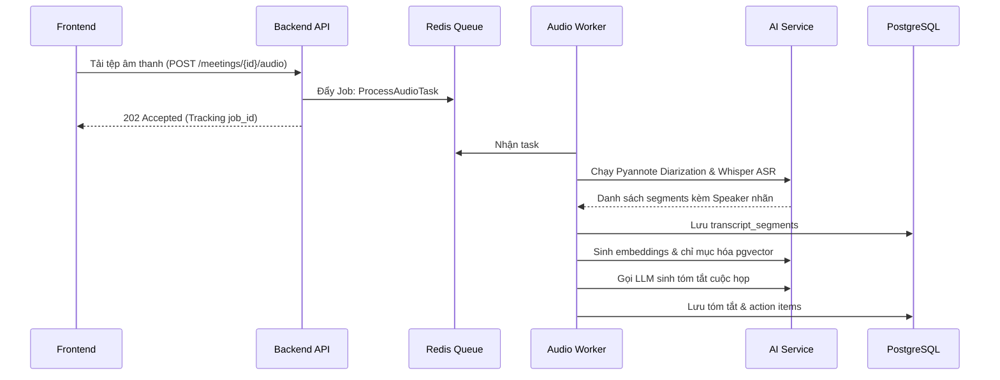

# Sơ Đồ Tuần Tự (Sequence Diagrams)

## Luồng 1: Real-time Audio Streaming & Transcription

```mermaid
sequenceDiagram
    participant User as Frontend (Browser)
    participant Backend as Backend API
    participant AI as AI Service
    participant WS as WebSocket Hub

    User->>Backend: Khởi tạo phiên họp (POST /meetings)
    Backend-->>User: Trả về meeting_id
    User->>WS: Kết nối WebSocket /live/{meeting_id}
    loop Mỗi 2 giây audio chunk
        User->>WS: Gửi binary audio stream
        WS->>AI: VAD + ASR Streaming Pipeline
        AI-->>WS: Segment text + timestamp
        WS-->>User: Broadcast interim/final transcript
    end
```

## Luồng 2: Asynchronous File Upload & Processing

```mermaid
sequenceDiagram
    participant User as Frontend
    participant Backend as Backend API
    participant Redis as Redis Queue
    participant Worker as Audio Worker
    participant AI as AI Service
    participant DB as PostgreSQL

    User->>Backend: Tải tệp âm thanh (POST /meetings/{id}/audio)
    Backend->>Redis: Đẩy Job: ProcessAudioTask
    Backend-->>User: 202 Accepted (Tracking job_id)
    Worker->>Redis: Nhận task
    Worker->>AI: Chạy Pyannote Diarization & Whisper ASR
    AI-->>Worker: Danh sách segments kèm Speaker nhãn
    Worker->>DB: Lưu transcript_segments
    Worker->>AI: Sinh embeddings & chỉ mục hóa pgvector
    Worker->>AI: Gọi LLM sinh tóm tắt cuộc họp
    Worker->>DB: Lưu tóm tắt & action items
```
